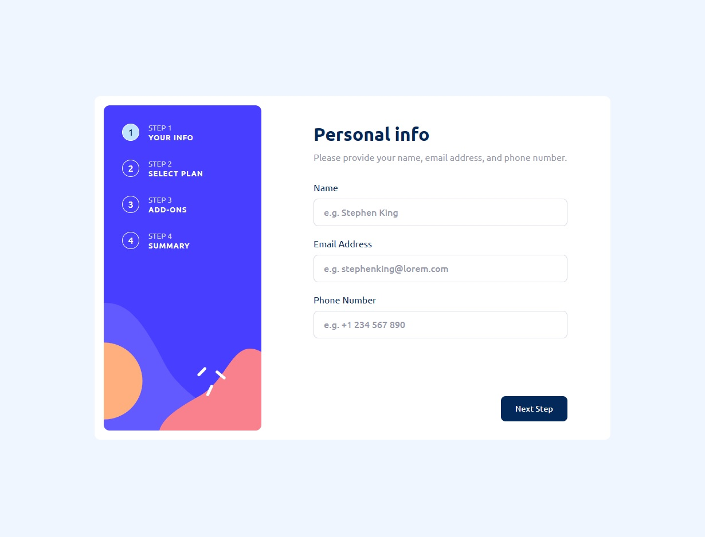

# Frontend Mentor - Multi-step form solution

This is a solution to the [Multi-step form challenge on Frontend Mentor](https://www.frontendmentor.io/challenges/multistep-form-YVAnSdqQBJ). Frontend Mentor challenges help you improve your coding skills by building realistic projects.

## Table of contents

- [Overview](#overview)
    - [The challenge](#the-challenge)
    - [Screenshot](#screenshot)
    - [Links](#links)
- [My process](#my-process)
    - [Built with](#built-with)
    - [What I learned](#what-i-learned)
    - [Useful resources](#useful-resources)
- [Author](#author)
- [Acknowledgments](#acknowledgments)

## Overview

### The challenge

Users should be able to:

- Complete each step of the sequence
- Go back to a previous step to update their selections
- See a summary of their selections on the final step and confirm their order
- View the optimal layout for the interface depending on their device's screen size
- See hover and focus states for all interactive elements on the page
- Receive form validation messages if:
    - A field has been missed
    - The email address is not formatted correctly
    - A step is submitted, but no selection has been made

### Screenshot



### Links

- Solution URL: [Multi-step form from "Frontend Mentor" solution](https://your-solution-url.com)
- Live Site URL: [Multi-step form from "GitHub" page](https://your-live-site-url.com)

## My process

### Built with

- Semantic HTML5 markup
- CSS custom properties
- Flexbox
- BEM Convention
- Javascript vanilla
- Mobile-first workflow
- Webpack
- NPM

### What I learned

I have learned how to make the layout of the application, using the design and resources provided, such as colors, sizes and shapes, as well as implementing an adaptable design according to the size of the screen of the device on which this application will be displayed.

Additionally, I highlight having learned a programming technique in javascript and also the use of a css property:

Declare a structure using the "mapping" technique.

```js
const planIdMap = {
  [plan.ARCADE]: planId.ARCADE_PLAN,
  [plan.ADVANCED]: planId.ADVANCED_PLAN,
  [plan.PRO]: planId.PRO_PLAN
};
```

Also, a way to optimize the download of the text font.

```css
@font-face {
    font-family: Ubuntu;
    src: url("/assets/fonts/Ubuntu-Regular.ttf");
    font-weight: normal;
  -> font-display: swap; <-
}
```

### Useful resources

- [BEM Convention](https://getbem.com) - This help me for to name selectors a way semantic.
- [MDN Documentation](https://developer.mozilla.org/es) - This help me for found documentation about to css and javascript properties.
- [NPM](https://www.npmjs.com) - A tool that allows me package or dependencies management in my project.
- [Webpack](https://webpack.js.org) - It helped me to package my app using different tools and plugins.

## Author

- LinkedIn - [Mark Anthony JC](https://www.linkedin.com/in/mark-anthony-jorge-cerr%C3%B3n-b3202b156/)
- Frontend Mentor - [@markanthony](https://www.frontendmentor.io/profile/markpiscis21)

## Acknowledgments

Grateful to [Fontend Mentor](https://www.frontendmentor.io) for the opportunity to provide learning content for thousands of people, helping us improve our web application development skills.
